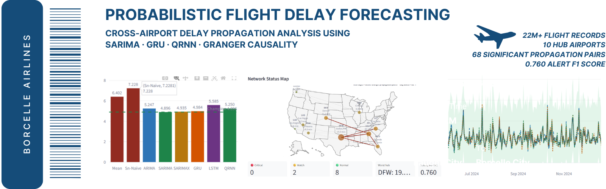
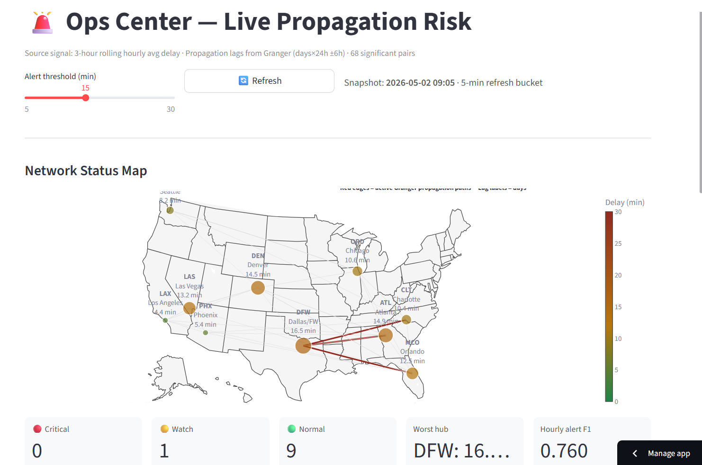
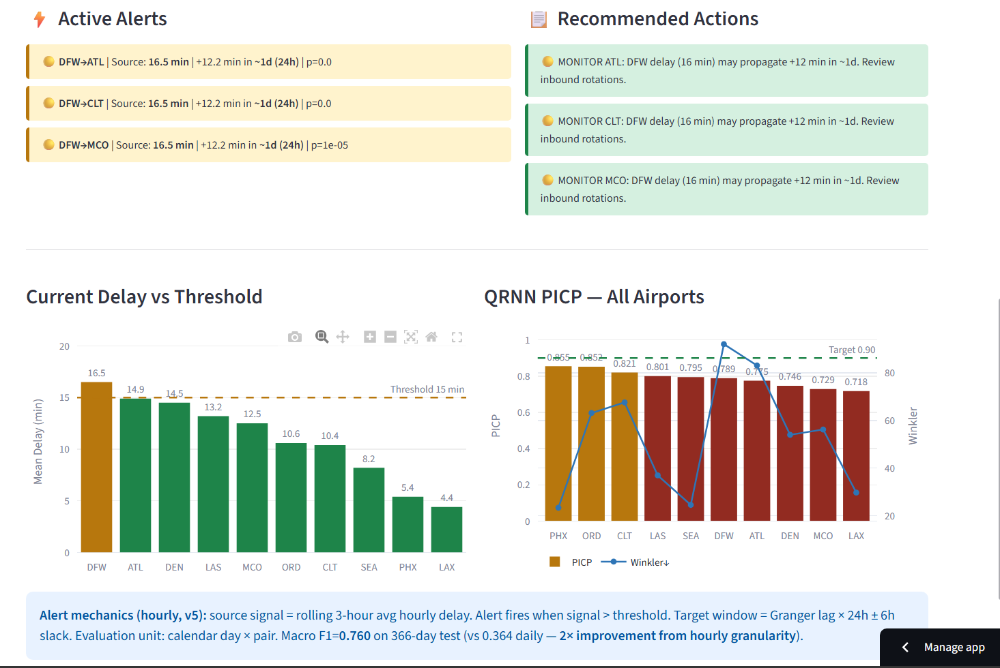
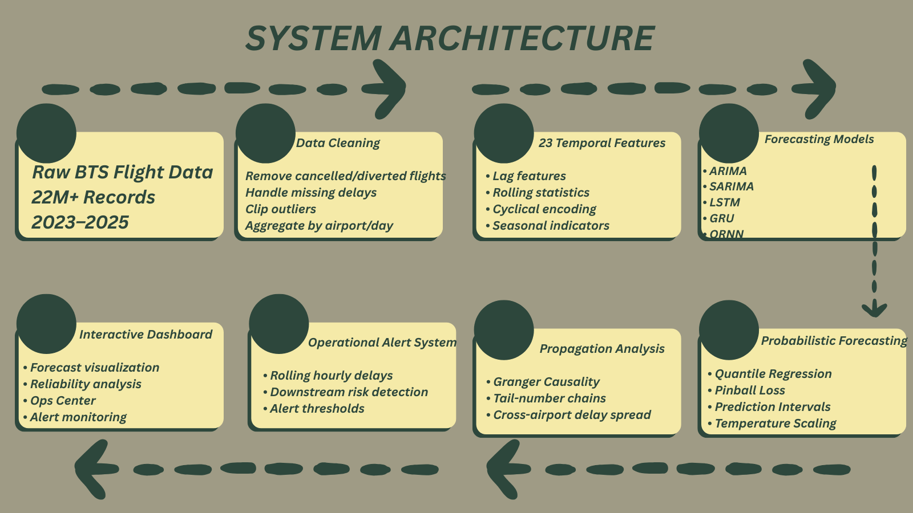

# ✈️ Probabilistic Flight Delay Forecasting


<p align="center">
  <a href="#-overview">Overview</a> •
  <a href="#-highlights">Highlights</a> •
  <a href="#-dashboard-preview">Dashboard</a> •
  <a href="#-system-architecture">Architecture</a> •
  <a href="#-models-implemented">Models</a> •
  <a href="#-key-results">Results</a>
</p>



<p align="center">
  <b>Aarsh Adhvaryu · Nikita Sharma · Ram Sharma</b>
</p>
---

## 🌐 Live Dashboard
👉 [Launch Streamlit App](https://flightdelayforecasting.streamlit.app/)

---

## 📌 Overview

A probabilistic time-series forecasting and propagation-analysis system for predicting cascading airport delays using:

- SARIMA
- GRU / LSTM
- Quantile Recurrent Neural Networks (QRNN)
- Granger Causality Analysis

The system models how delays spread across major US hub airports and generates operational downstream alert predictions with calibrated uncertainty intervals.

---

## 🚀 Highlights

- Processed **22M+ BTS flight records**
- Forecasted delays across **10 major US hub airports**
- Achieved **23.5% RMSE improvement** over baseline models
- Detected **68 statistically significant propagation pathways**
- Built an hourly alert system achieving **0.760 Macro F1**
- Developed a fully interactive **Streamlit operations dashboard**

---

## 🖥️ Dashboard





---

## 🧠 Why This Matters

Flight delays create cascading operational disruptions through:

- aircraft rotations
- crew scheduling
- passenger connections
- airport congestion

Traditional systems forecast airports independently.

This project introduces:
- probabilistic uncertainty estimation
- cross-airport propagation modeling
- operational alert systems for downstream disruption prediction

---

## 🏗️ Architecture



## Table of Contents

1. [Project Overview](#project-overview)
2. [Research Questions](#research-questions)
3. [Repository Structure](#repository-structure)
4. [Installation & Setup](#installation--setup)
5. [Running the Project](#running-the-project)
6. [Data Pipeline](#data-pipeline)
7. [Models Implemented](#models-implemented)
8. [Key Results](#key-results)
9. [Dashboard Guide](#dashboard-guide)
10. [Reproducibility](#reproducibility)
11. [Dependencies](#dependencies)

---

## Project Overview

Flight delays at hub airports do not occur in isolation — they cascade across the network through shared aircraft rotations, crews, and passengers. Current operational systems issue single-point forecasts and treat airports independently, providing no quantification of how wrong those forecasts might be.

This project builds a **probabilistic forecasting pipeline** that:

- Provides **calibrated prediction intervals** via Quantile Recurrent Neural Networks (QRNN) trained with Pinball Loss
- Models **cross-airport delay propagation** through Granger causality testing on daily/hourly aggregated delays and physical tail-number aircraft chain analysis
- Delivers an **operational hourly alert system** that fires when a source hub's rolling 3-hour average delay exceeds a configurable threshold, predicting downstream impacts using statistically validated lag windows

The target variable is the **daily mean departure delay (minutes) per airport**, benchmarked against the US BTS standard (≥15 min = delay).


## Repository Structure

```
.
├── flight_delay.ipynb          # Main analysis notebook (Cells 1–116)
├── dash.py                     # Streamlit interactive dashboard
├── requirements.txt            # Python dependencies
├── README.md                   # This file
├── dashboard                   # Results
├── ppt.pdf
├── runtime.txt
└── Flight_Delay_report.docx


```

### Notebook Cell Map

| Cell Range | Stage |
|-----------|-------|
| 2–3 | Data ingestion (parquet load, 22M rows) |
| 5–6 | Cleaning (drop cancelled, clip delays, fill NaNs) |
| 8 | Global config (TOP_N=10, TEST_DAYS=365, SEED=42) |
| 11–14 | Daily aggregation + assertion guards |
| 17–25 | Exploratory Data Analysis (EDA) — heatmaps, delay causes |
| 27–29 | STL decomposition — seasonal/trend strength |
| 31–33 | Stationarity (ADF), ACF/PACF process identification |
| 35–38 | Feature engineering (23 features) |
| 40–41 | Train/test split (516 train / 366 test days) |
| 43–49 | Baseline models + point forecast metrics |
| 52–55 | ARIMA (auto_arima, non-seasonal) |
| 57–59 | SARIMA (auto_arima, m=7 weekly) |
| 61–66 | SARIMAX + exogenous feature selection |
| 72–78 | LSTM (hidden=64, seq=21) |
| 80–82 | GRU (hidden=64, 17K params) |
| 84–89 | QRNN (Pinball Loss, 7 quantiles, temperature scaling) |
| 92–95 | Master loop — all models × 10 airports |
| 96–101 | Residual noise analysis — normality + distribution fitting |
| 102–106 | Tail-number flight chain analysis |
| 107–108 | Daily & hourly wide matrices |
| 109–112 | Granger causality (68 significant pairs) |
| 113–116 | Hourly alert system evaluation (F1 = 0.760) |

---


## Models

### Baseline Models

| Model | Rule |
|-------|------|
| Arithmetic Mean | Always predict training mean |
| Naïve | Last observed value |
| Seasonal Naïve | Same weekday last week (lag-7) |
| Moving Average (k=7) | Mean of last 7 observations |

### Statistical Models

| Model | Specification | PHX RMSE |
|-------|--------------|----------|
| ARIMA | (0,1,2) — auto-selected via AIC | 5.247 min |
| SARIMA | (1,0,2)×(0,1,1)[7] — weekly seasonal | **4.896 min** ← Champion |
| SARIMAX | SARIMA + {weather_lag1, is_summer, is_weekend} | 4.935 min |

### Deep Learning Models

| Model | Architecture | PHX RMSE |
|-------|-------------|----------|
| LSTM | 2-layer, hidden=64, seq_len=21, early stop | 5.585 min |
| GRU | 1-layer, hidden=64, 17K params, early stop | 4.985 min |
| QRNN | Pinball Loss, 7 quantiles (0.05–0.95), T-scaling | 5.250 min (median) |

### Evaluation Metrics

**Point forecasts:** RMSE, MAE, MAPE, sMAPE  
**Probabilistic:** PICP (target ≥ 0.90), PINAW (lower = sharper), Winkler Score  
**Propagation alert:** Precision, Recall, F1 (per pair and macro)

---

## Results

### Champion Model: SARIMA (PHX focus airport)

```
Champion model : SARIMA (1,0,2)(0,1,1)[7]
Champion RMSE  : 4.896 min
Beats best baseline by: 1.506 min RMSE (23.5% improvement)
```

### All-Airport RMSE Summary

| Airport | ARIMA | GRU | LSTM | QRNN | PICP | Winkler |
|---------|-------|-----|------|------|------|---------|
| ATL | 17.56 | 19.95 | 19.82 | 19.76 | 0.775 | 83.1 |
| DEN | 9.80 | 10.99 | 10.92 | 11.04 | 0.746 | 54.0 |
| DFW | 16.87 | 18.34 | 18.70 | 18.30 | 0.789 | 92.1 |
| ORD | 11.84 | 11.98 | 13.03 | 12.88 | 0.852 | 63.1 |
| CLT | 10.81 | 12.24 | 13.92 | 13.42 | 0.821 | 67.6 |
| LAX | 4.94 | 5.09 | 5.66 | 6.28 | 0.718 | 29.7 |
| PHX | **4.90** | 4.98 | 5.59 | 5.25 | **0.855** | **23.2** |
| LAS | 8.41 | 9.06 | 8.74 | 8.32 | 0.801 | 37.0 |
| SEA | 4.85 | 4.97 | 5.12 | 5.28 | 0.795 | 24.6 |
| MCO | 10.75 | 12.11 | 12.65 | 11.64 | 0.729 | 56.2 |

### Residual Noise (RQ1)

All 10 airports reject Gaussian at α = 0.05. Shapiro-Wilk p ranges from 3.2×10⁻¹⁶ (SEA) to 1.6×10⁻³⁰ (DFW). Log-Normal (shifted) wins AIC comparison (3600 vs Normal 3793).

### Propagation & Alerts (RQ3)

| Metric | Daily (old) | Hourly (v5) | Improvement |
|--------|------------|-------------|-------------|
| Macro Precision | 0.414 | **0.803** | +38.9 pp |
| Macro Recall | 0.403 | **0.730** | +32.7 pp |
| Macro F1 | 0.364 | **0.760** | +39.6 pp (×2.1) |

Top alert pair: **CLT→MCO** F1 = 0.892, Precision = 0.900  
Highest precision: **PHX→DFW** Precision = 0.930 (near-zero false alarms)  
Mean tail-chain carry-over: **74.2%** across 793,941 chain pairs

---
